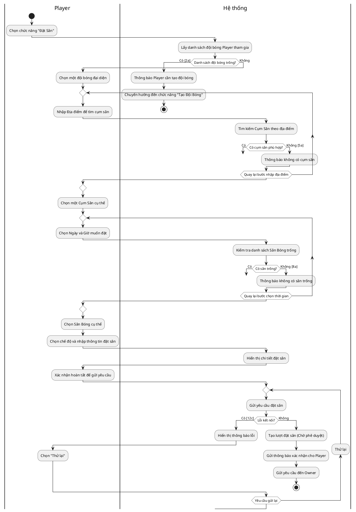

```plantuml
@startuml
skinparam Monochrome true
skinparam shadowing false
skinparam ActivityDiamondBackgroundColor white

|Player|
start
:Chọn chức năng "Đặt Sân";

|Hệ thống|
:Lấy danh sách đội bóng Player tham gia;

if (Danh sách đội bóng trống?) then (Có [2a])
    :Thông báo Player cần tạo đội bóng;
    :Chuyển hướng đến chức năng "Tạo Đội Bóng";
    stop
else (Không)
    |Player|
    :Chọn một đội bóng đại diện;
    
    repeat
        :Nhập Địa điểm để tìm cụm sân;
        |Hệ thống|
        :Tìm kiếm Cụm Sân theo địa điểm;
        if (Có cụm sân phù hợp?) then (Có)
            break
        else (Không [5a])
            :Thông báo không có cụm sân;
        endif
    repeat while (Quay lại bước nhập địa điểm)

    |Player|
    :Chọn một Cụm Sân cụ thể;
    
    repeat
        :Chọn Ngày và Giờ muốn đặt;
        |Hệ thống|
        :Kiểm tra danh sách Sân Bóng trống;
        if (Có sân trống?) then (Có)
            break
        else (Không [8a])
            :Thông báo không có sân trống;
        endif
    repeat while (Quay lại bước chọn thời gian)

    |Player|
    :Chọn Sân Bóng cụ thể;
    :Chọn chế độ và nhập thông tin đặt sân;
    
    |Hệ thống|
    :Hiển thị chi tiết đặt sân;
    
    |Player|
    :Xác nhận hoàn tất để gửi yêu cầu;

    |Hệ thống|
    repeat
        :Gửi yêu cầu đặt sân;
        if (Lỗi kết nối?) then (Có [12c])
            :Hiển thị thông báo lỗi;
            |Player|
            :Chọn "Thử lại";
            |Hệ thống|
        else (Không)
            :Tạo lượt đặt sân (Chờ phê duyệt);
            :Gửi thông báo xác nhận cho Player;
            :Gửi yêu cầu đến Owner;
            stop
        endif
    backward:Thử lại;
    repeat while (Yêu cầu gửi lại)
endif
@enduml
```
