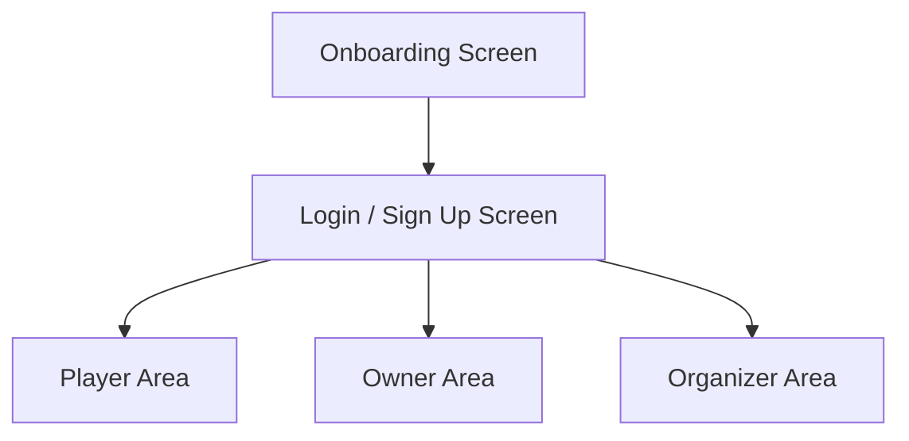
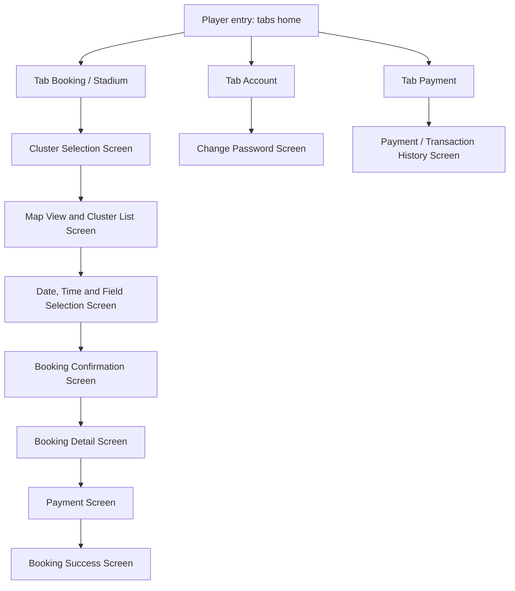
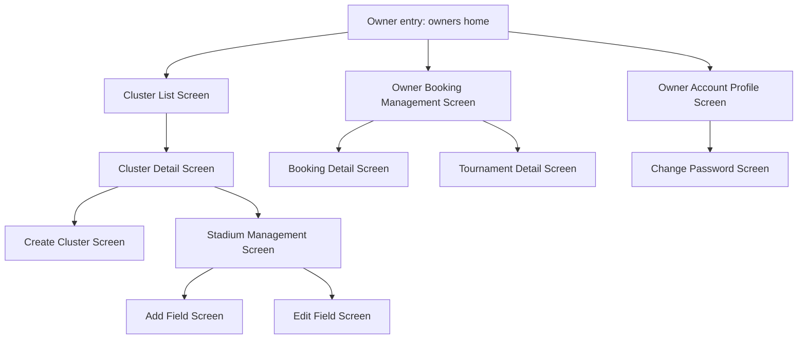
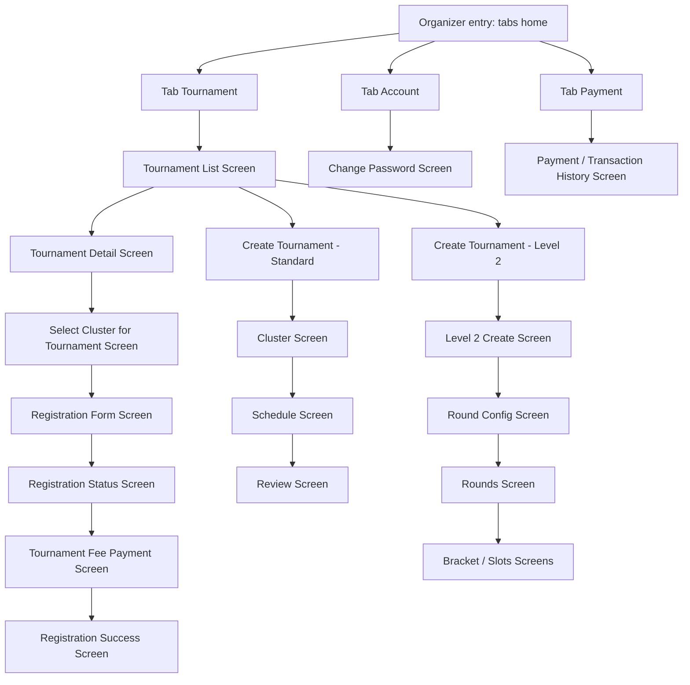

# Sơ đồ luồng giao diện của ứng dụng

Sơ đồ dưới đây bám theo route và screen hiện có trong code. Để dễ nhìn hơn, phần luồng UI được tách thành 4 sơ đồ: một sơ đồ tổng quát và 3 sơ đồ theo vai trò Player, Owner và Organizer.

## 1. Tổng quan

## 2. Player

## 3. Owner

## 4. Organizer

